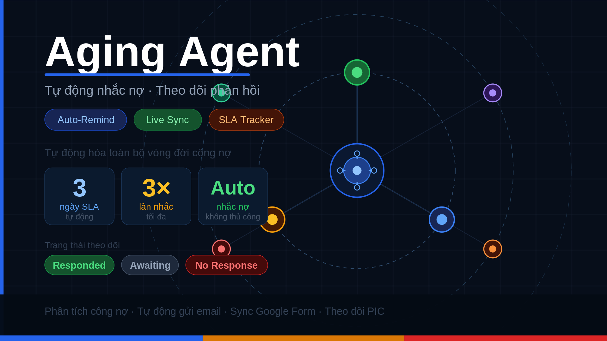

# Aging Agent

Hệ thống tự động hóa quy trình theo dõi và nhắc nợ cho bộ phận AR (Accounts Receivable).



---

## Tính năng chính

### Dashboard
- Upload file AR Excel → sinh dashboard HTML hiển thị toàn bộ công nợ theo PIC
- Lọc tự động: chỉ hiển thị và gửi mail các khoản **overdue** (bỏ qua "Current")
- Theo dõi 4 cột trạng thái: **Reminded**, **Email Sent**, **PIC Response**, **Notes**
- Trạng thái persist server-side qua `debt_tracker.json` — reload trang không mất dữ liệu

### Gửi email nhắc nợ
- Gửi song song qua Gmail SMTP (ThreadPoolExecutor) — nhanh hơn gửi tuần tự
- From hiển thị: `AR System (no-reply)` — Reply-To: `no-reply@donotreply.invalid`
- Body email gồm bảng invoice với cột **Lần nhắc** (màu xanh/cam/đỏ theo số lần)
- SLA enforcement: không cho gửi lại nếu chưa đủ **3 ngày làm việc** kể từ lần gửi trước
- Unmapped PIC (chưa có email) bị ẩn khỏi modal gửi mail

### Vòng đời tự động (Auto-Remind)
```
Gửi mail lần 1 → Awaiting
       ↓ (sau 3 ngày làm việc, không có response)
   No Response → Tự động gửi mail lần 2 → Awaiting
       ↓ (sau 3 ngày làm việc, không có response)
   No Response → Tự động gửi mail lần 3 → Awaiting
       ↓
   Dừng (tối đa 3 lần nhắc — 3/3)
```

### Sync phản hồi từ Google Form / Sheet
- Auto-sync mỗi 10 giây: Google Sheet → cập nhật `PIC Response` + `Notes`
- Nếu PIC xóa response khỏi Google Sheet → tự reset về **Awaiting** + xóa Notes
- Chuẩn hóa Unicode (bỏ dấu tiếng Việt) khi match tên PIC với header Google Sheet


### Cập nhật thông tin Payment SLA (chưa chạy agent)
- Thực hiện trong phase 2 --> chưa làm kịp
- Output: Phân tích tình trạng nợ xấu, số lượng/ lần lặp lại, đề xuất cải thiện (sau khi chạy khoảng 3 tháng và thu thập được số lượng tệp lớn khoảng 300 mẫu)
---

## Cấu trúc repo

```
├── app.py                      # FastAPI server — API endpoints + dashboard logic
├── Dockerfile                  # Docker image để deploy lên AgentBase
├── requirements.txt            # Python dependencies
├── deploy.py                   # Script deploy lên VNG Cloud AgentBase
├── status.py                   # Kiểm tra trạng thái runtime
├── make_public.py              # Chuyển endpoint sang Public
├── pic_emails.json             # Mapping PIC name → email address
├── debt_tracker.json           # Server-side state: email_sent, pic_resp, ghi_chu, reminder_count
└── scripts/
    ├── parse_ar.py                      # Parse file AR Excel
    ├── parse_ap_aging.py                # Parse file AP Aging
    ├── parse_tam_ung.py                 # Parse file Tạm ứng
    ├── parse_prepay.py                  # Parse file Prepayment
    ├── detect_type.py                   # Tự động nhận diện loại file
    ├── generate_combined_dashboard.py   # Tạo HTML dashboard (AR + AP + Tạm ứng + Prepay)
    ├── generate_combined_master.py      # Tạo AR Master Excel tổng hợp
    ├── generate_combined_sla_tracker.py # Tạo SLA Tracker Excel
    └── send_emails.py                   # Gửi email nhắc nợ (parallel SMTP)
```

---

## Cấu hình

### 1. Biến môi trường (file `.env`)

```env
GMAIL_USER=your_email@gmail.com
GMAIL_APP_PASSWORD=xxxx-xxxx-xxxx-xxxx
```

> Tạo App Password tại: Google Account → Security → 2-Step Verification → App passwords

### 2. Mapping PIC → Email (`pic_emails.json`)

```json
{
  "Nguyen Van A": "a.nguyen@company.com",
  "Tran Thi B":   "b.tran@company.com"
}
```

### 3. Google Form / Sheet

Cập nhật URL Google Sheet trong `app.py`:
```python
GSHEET_CSV = "https://docs.google.com/spreadsheets/d/<SHEET_ID>/export?format=csv"
```

---

## Chạy local

```bash
pip install -r requirements.txt
uvicorn app:app --host 0.0.0.0 --port 8080 --reload
```

Truy cập: `http://localhost:8080`

---

## Deploy lên VNG Cloud AgentBase

```bash
python deploy.py
```

Sau khi deploy, chuyển endpoint sang Public:
```bash
python make_public.py
```

Kiểm tra trạng thái:
```bash
python status.py
```

Endpoint hiện tại:
```
https://endpoint-27eb5189-b34d-4ce1-9a2c-7fdbc97411b2.agentbase-runtime.aiplatform.vngcloud.vn
```

---

## API Endpoints

| Method | Path | Mô tả |
|--------|------|--------|
| `GET` | `/` | Dashboard HTML |
| `POST` | `/api/upload` | Upload file AR Excel, sinh dashboard |
| `GET` | `/api/pics` | Danh sách PIC có invoice overdue + mapping email |
| `POST` | `/api/send` | Gửi email nhắc nợ cho các PIC đã chọn |
| `GET` | `/api/sync-responses` | Sync phản hồi từ Google Sheet về tracker |
| `POST` | `/api/tracker/update` | Dashboard push state changes lên server |

---

## Xử lý sự cố

### Dashboard hiển thị dữ liệu cũ sau khi reload
Server-side tracker (`debt_tracker.json`) giữ dữ liệu qua các lần reload. Nếu cần reset thủ công một PIC về Awaiting, chạy trong DevTools Console (đang mở dashboard):

```js
var updates={};
ROWS.forEach(function(r){
  if(r.pic_resp==='Responded'){
    var k=(r.invoice&&r.entity)?(r.invoice+'|'+r.entity):(r.entity+'|'+r.inv_date);
    updates[k]={pic_resp:'Awaiting',ghi_chu:''};
    r.pic_resp='Awaiting'; r.ghi_chu='';
  }
});
fetch('/api/tracker/update',{method:'POST',headers:{'Content-Type':'application/json'},
  body:JSON.stringify({updates:updates})})
  .then(r=>r.json()).then(d=>{saveLocal();refresh();console.log('Reset xong:',d);});
```

### Port bị chiếm khi chạy local
```bash
# Tìm và kill process đang dùng port 8080
lsof -ti:8080 | xargs kill -9
```
